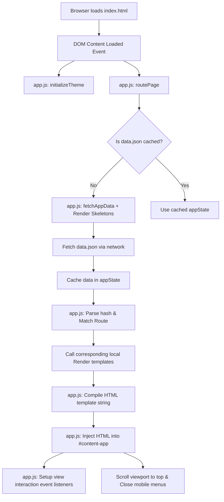

# UITS Course Mastery Portal Documentation

Welcome to the **UITS Course Mastery** portal documentation. This document describes the codebase file structure, architecture, and data routing flow of the Single Page Application (SPA).

---

## 📂 File Structure

The project is built using a lightweight, dependency-free vanilla web stack (HTML5, CSS3, ES6+ Javascript) and follows a clean separation of concerns:

```
c:\Users\gsmur\Documents\GitHub\[oU1TS]\course
├── index.html          # Main HTML5 shell and viewport layout container
├── style.css           # Typography, themes (dark/light), and layout styles
├── app.js              # SPA router, state manager, and UI template rendering functions
├── data.json           # Centralized database (discussion links, roadmaps, resources)
├── render.html         # Local markdown document viewer
├── render.js           # Markdown parser and search engine for render.html
├── css/
│   └── render.css      # Markdown viewer stylesheet (KaTeX/Highlight/TOC)
├── explain.md          # Technical guide detailing data-to-view mapping rules
├── documentation.md    # Codebase architectural and lifecycle documentation
└── README.md           # Quick setup and introduction guide
```

### Detailed File Descriptions

1. **[index.html](Documents/GitHub/[oU1TS]/course/index.html)**
   - Serves as the single viewport shell.
   - Contains static global elements: `<header>` (logo, navigation drawer, theme switch, hamburger toggle), `<footer>`, and the overlay modal shell (`#roadmap-modal`).
   - Hooks up the main entry viewport: `<main id="content-app">`.

2. **[style.css](Documents/GitHub/[oU1TS]/course/style.css)**
   - Stores design system tokens as CSS Variables in `:root` and `body.light-theme`.
   - Uses pure black (`#000000` default dark theme) and pure white (`#ffffff` light theme) color definitions (no gradients) with solid borders.
   - Leverages modern CSS features (Flexbox, Grid, transitions, and media queries) for smooth, responsive layout rendering across mobile and desktop displays.

3. **[app.js](Documents/GitHub/[oU1TS]/course/app.js)**
   - Initializes the application and controls client-side routing based on `window.location.hash`.
   - Lazily fetches `data.json` on app load and caches the state in memory.
   - Binds event listeners for UI interactions: mobile drawer toggle, theme switcher, modal popups, and route changes.
   - Contains stateless template compilation functions (formerly in `render.js`) that compile raw JSON data slices and inject them as safe, XSS-escaped HTML templates into `#content-app`.

4. **[data.json](Documents/GitHub/[oU1TS]/course/data.json)**
   - The centralized JSON database.
   - Houses structural content including motto descriptions, roadmap steps, recorded discussions, resource categories, and channel links.

5. **[render.html](Documents/GitHub/[oU1TS]/course/render.html)**
   - Stands as a separate markdown document viewer shell.
   - Loads markdown parser scripts, sanitizers, LaTeX renderers, and code styling libraries from CDN resources to render documents locally.

6. **[render.js](Documents/GitHub/[oU1TS]/course/render.js)**
   - Acts as the controller for the markdown document viewer.
   - Parses markdown into safe HTML, hooks page navigation anchors, resolves relative asset paths, compiles a slide-out Table of Contents, and runs a client-side full-text search.

---

## 🔄 Data Flow & Routing Architecture

The application operates as a Hash-Based Client-Side Router. Pages are loaded dynamically without reloading the browser window.

### Architecture Diagram

The flow of initialization, user routing, and data binding is visualized below:



### Detailed Routing Step-by-Step

#### 1. Page Load & Initial Render
- When the user visits `index.html`, the browser loads the DOM and executes `app.js`.
- `app.js` runs `initializeTheme()` to query `localStorage` or OS preferences for theme selection.
- It then executes `routePage()` to resolve the initial view. If no hash exists (or an invalid one is specified), it defaults to `#home` and updates the browser history.

#### 2. Network Fetching & Skeletons
- If `appState` is null, `fetchAppData()` is triggered.
- While the fetch promise is pending, `renderSkeletons()` is called, injecting a loading skeleton structure into `<main id="content-app">`.
- `data.json` is retrieved via `fetch()`. Once resolved, the parsed JSON object is saved in the memory variable `appState` to prevent subsequent network requests.

#### 3. View Resolution and Rendering
- The router matches the active hash (`#home`, `#discussions`, `#resources`, `#about`, `#join`) against its `validRoutes` map.
- It calls the corresponding render template inside the local `Render` object in `app.js`, passing the cached `appState` data.
- The render templates process the data loop, escape strings using `escapeHTML()` to prevent XSS, construct the raw HTML string, and return it.
- `app.js` takes the returned string and sets `contentApp.innerHTML`.

#### 4. Event Binding and Cleanup
- After mounting the HTML, `setupViewInteractions()` binds post-render event listeners (like attaching click events to the homepage roadmap steps to open the roadmap details modal).
- The window is scrolled back to `(0, 0)` to guarantee a fresh page layout.
- Any open mobile hamburger drawers are closed.

---

## 🗃️ State Management

The application state is minimal and managed entirely in the client window:

1. **Theme State**: Synced using the `light-theme` class on the `<body>` element and persisted in `localStorage.getItem('theme')`.
2. **Database Content**: Stored in a single in-memory variable `appState` in `app.js` closure once fetched from `data.json`.
3. **Modal Overlay State**: Controlled by class manipulation (`.open`) and accessibility attributes (`aria-hidden`) on the static `#roadmap-modal` container element in `index.html`.

---

## 🕒 Version History

### 🚀 v1.1.0 — Architecture Refactoring & Markdown Viewer (Current)
* **SPA Code Simplification**: Merged page template rendering functions directly into `app.js`. Removed the separate SPA layout renderer script references from `index.html`.
* **Markdown Document Integration**: Added `render.html`, `render.js`, and `css/render.css` to enable local rendering of markdown documentation and reference files (e.g. `documentation.md` and `explain.md`).
* **Footer Optimization**: Made the footer persistent, reduced its vertical spacing (padding), and moved the technical document viewer links underneath the copyright text at the bottom.
* **Scroll Snapping & Viewport Centering**: Applied CSS vertical scroll snapping to the home page on desktop, defining `.hero-wrapper` and `.roadmap-container` to take up screen-height columns for slides-like traversal.
* **Color Palette Consistency**: Mapped the markdown document viewer variables to align with the pure black and white styling (no gradients) of the main portal.

### 🚀 v1.0.0 — Initial SPA Release
* **Responsive Layout Shell**: Established `index.html` structure with responsive mobile-first grids, top navigation bar, and right-sliding hamburger menu drawer.
* **State-Driven Rendering**: Linked all sections (Home, Discussions, Resources, About Us, Join Us) to feed dynamically from a centralized `data.json` file.
* **Timeline Block Modal**: Created an interactive block timeline for the study roadmap on the homepage, showing detailed floating modal overlays upon click.
* **Theme Switching**: Implemented a core theme switcher toggle with a default pure black dark mode and pure white light mode (no gradients).
