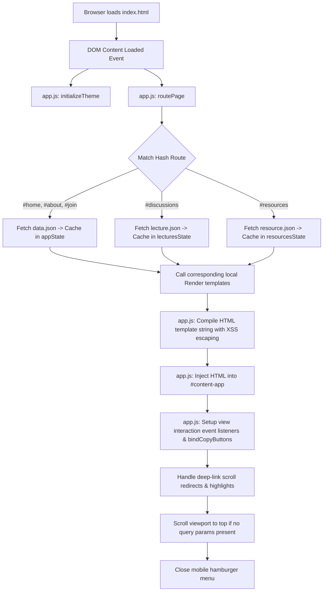

# UITS Course Mastery Portal Documentation

Welcome to the **UITS Course Mastery** portal documentation. This document describes the codebase file structure, architecture, and data routing flow of the Single Page Application (SPA).

Repository: https://github.com/oU1TS/course

---

## 📂 File Structure

The project is built using a lightweight, dependency-free vanilla web stack (HTML5, CSS3, ES6+ Javascript) and follows a clean separation of concerns:

```
c:\Users\gsmur\Documents\GitHub\[oU1TS]\course
├── index.html          # Main HTML5 shell and viewport layout container
├── style.css           # Typography, themes (dark/light), layouts, modal, and copy styles
├── app.js              # SPA router, state manager, view renderers, and event managers
├── data.json           # Content database for roadmap, about, and join sections
├── lecture.json        # Content database for recorded peer classes and course lectures
├── resource.json       # Content database for academic toolkits, drives, and trackers
├── render.html         # Local markdown document viewer
├── render.js           # Markdown parser and search engine for render.html
├── css/
│   └── render.css      # Markdown viewer stylesheet (KaTeX/Highlight/TOC)
├── explain.md          # Technical guide detailing data-to-view mapping rules
├── documentation.md    # Codebase architectural and lifecycle documentation
└── README.md           # Quick setup and introduction guide
```

### Detailed File Descriptions

1. **[index.html](index.html)**
   - Serves as the single viewport shell.
   - Contains static global elements: `<header>` (logo, navigation drawer, theme switch, hamburger toggle), `<footer>`, and two overlay modal shells: `#roadmap-modal` (for step details) and `#lecture-select-modal` (for select dialogs when multiple related lectures exist).
   - Hooks up the main entry viewport: `<main id="content-app">`.

2. **[style.css](style.css)**
   - Stores design system tokens as CSS Variables in `:root` and `body.light-theme`.
   - Uses pure black (`#000000` default dark theme) and pure white (`#ffffff` light theme) color definitions (no gradients) with solid borders.
   - Contains styles for the course accordion panels, resource card elements, select list cards, and link-copying success states.

3. **[app.js](app.js)**
   - Initializes the application and controls client-side routing based on `window.location.hash`.
   - Lazily fetches and caches `data.json`, `lecture.json`, and `resource.json` depending on the active page, saving states into in-memory variables (`appState`, `lecturesState`, and `resourcesState`).
   - Binds event listeners for UI interactions: mobile drawer toggle, theme switcher, modal popups, accordion expanders, copy-link clicks, and route changes.
   - Contains stateless template compilation functions that compile raw JSON data slices and inject them as safe, XSS-escaped HTML templates into `#content-app`.

4. **[data.json](data.json)**
   - Stores structural page metadata including motto descriptions, roadmap steps, about text blocks, and channel links.

5. **[lecture.json](lecture.json)**
   - Grouped peer recorded lectures, semesters, guided instructors, video links, and note urls indexed by unique course IDs (`courseId`) and lecture IDs (`lectureId`).

6. **[resource.json](resource.json)**
   - Curated study folders, repository links, and guides mapped to unique resource IDs (`resourceId`) and related course or lecture IDs.

---

## 🔄 Data Flow & Routing Architecture

The application operates as a Hash-Based Client-Side Router. Pages are loaded dynamically without reloading the browser window.

### Architecture Diagram

The flow of initialization, user routing, and data binding is visualized below:



### Detailed Routing Step-by-Step

#### 1. Page Load & Initial Render
- When the user visits `index.html`, the browser loads the DOM and executes `app.js`.
- `app.js` runs `initializeTheme()` to query `localStorage` or OS preferences for theme selection.
- It then executes `routePage()` to resolve the initial view. If no hash exists (or an invalid one is specified), it defaults to `#home` and updates the browser history.

#### 2. Network Fetching & Skeletons
- If the requested state cache (`appState`, `lecturesState`, or `resourcesState`) is null, `fetchAppData()` is triggered.
- While the fetch promise is pending, `renderSkeletons()` is called, injecting a loading skeleton structure into `<main id="content-app">`.
- The target JSON database file is retrieved via `fetch()`. Once resolved, the parsed JSON object is saved in the memory cache to prevent subsequent network requests.

#### 3. View Resolution and Rendering
- The router matches the active hash (`#home`, `#discussions`, `#resources`, `#about`, `#join`) against its `validRoutes` map.
- It calls the corresponding render template inside the local `Render` object in `app.js`, passing the cached data.
- The render templates process the data loop, escape strings using `escapeHTML()` to prevent XSS, construct the raw HTML string, and return it.
- `app.js` takes the returned string and sets `contentApp.innerHTML`.

#### 4. Event Binding and Cleanup
- After mounting the HTML, `setupViewInteractions()` binds post-render event listeners:
  - **Home**: Binds clicks on roadmap steps to open `#roadmap-modal`.
  - **Discussions**: Binds collapsible course accordion panels and auto-expands/scrolls/flashes target lectures if `lecture` or `course` parameters exist in the URL query.
  - **Resources**: Binds multiple related lecture buttons to trigger `#lecture-select-modal`. Auto-scrolls and flashes card if `resource` parameter exists in the URL query.
  - **Global**: Binds `.btn-copy-id` sharing button actions to copy deep link URLs directly to the clipboard.

---

## 🗃️ State Management

The application state is minimal and managed entirely in the client window:

1. **Theme State**: Synced using the `light-theme` class on the `<body>` element and persisted in `localStorage.getItem('theme')`.
2. **Database Caches**: Stored in closure variables `appState`, `lecturesState`, and `resourcesState` in `app.js`.
3. **Modal Overlay States**: Controlled by class manipulation (`.open`) and accessibility attributes (`aria-hidden`) on static modal wrappers in `index.html`.
4. **Copy Feedback State**: Handled using temporary class addition (`.copy-success`) and SVG changes to show a checkmark feedback indicator for 1.5 seconds.

---

## 🕒 Version History

### 🔗 v1.2.0 — Content Segregation, Deep Linking & Selection Popups (Current)
* **Content Segregation**: Separated core page data, lecture discussions, and academic resources into distinct databases (`data.json`, `lecture.json`, and `resource.json`) to minimize bundle sizes.
* **Collapsible Accordions**: Replaced the long discussions list with a collapsible accordion grouped by courses.
* **Clipboard Deep-Link Sharing**: Added link buttons next to Courses, Lectures, and Resources that generate absolute deep-linking URLs, copying them with transition success checkmarks.
* **Selection Popups**: Added a selector modal that displays all options when clicking a resource related to multiple peer lectures.
* **URL Parameter Actions**: Programmed routing redirects that expand accordions, scroll to targets, and apply highlight flashes when accessing a copied URL.

### 🚀 v1.1.0 — Architecture Refactoring & Markdown Viewer
* **SPA Code Simplification**: Merged page template rendering functions directly into `app.js`. Removed the separate SPA layout renderer script references from `index.html`.
* **Markdown Document Integration**: Added `render.html`, `render.js`, and `css/render.css` to enable local rendering of markdown documentation and reference files (e.g. `documentation.md` and `explain.md`).
* **Footer Optimization**: Made the footer persistent, reduced its vertical spacing (padding), and moved the technical document viewer links underneath the copyright text at the bottom.
* **Scroll Snapping & Viewport Centering**: Applied CSS vertical scroll snapping to the home page on desktop, defining `.hero-wrapper` and `.roadmap-container` to take up screen-height columns for slides-like traversal.
* **Color Palette Consistency**: Mapped the markdown document viewer variables to align with the pure black and white styling (no gradients) of the main portal.

### 🚀 v1.0.0 — Initial SPA Release
* **Responsive Layout Shell**: Established `index.html` structure with responsive mobile-first grids, top navigation bar, and right-sliding hamburger menu drawer.
* **State-Driven Rendering**: Linked all sections (Home, Discussions, Resources, About Us, Join Us) to feed dynamically from a centralized `data.json` file.
* **Timeline Block Modal**: Created an interactive block timeline for the study roadmap on the homepage, showing detailed floating modal overlays upon click.
* **Theme Switching**: Implemented a core theme switcher toggle with a default pure black dark mode and pure white light mode (no gradients).
