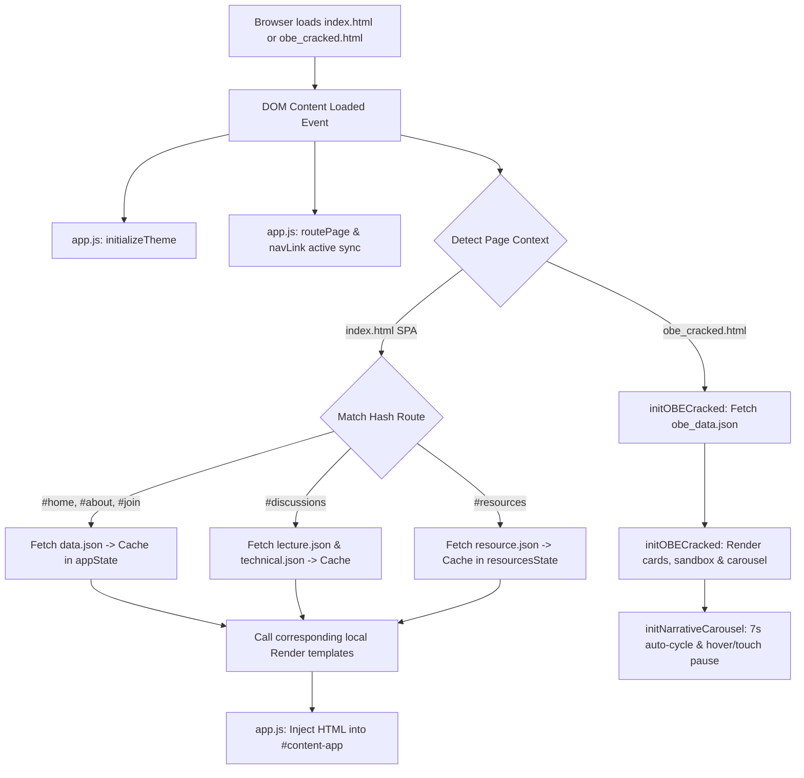

# UITS Course Mastery Portal Documentation

Welcome to the **UITS Course Mastery** portal documentation. This document describes the codebase file structure, architecture, and data routing flow of the Single Page Application (SPA).

Repository: https://github.com/oU1TS/course

---

## 📂 File Structure

The project is built using a lightweight, dependency-free vanilla web stack (HTML5, CSS3, ES6+ Javascript) and follows a clean separation of concerns:

```
c:\Users\gsmur\Documents\GitHub\[oU1TS]\course
├── index.html          # Main HTML5 shell and viewport layout container
├── obe_cracked.html    # Standalone single-page component layout for OBE Cracked
├── style.css           # Typography, themes (dark/light), layouts, modal, and copy styles
├── app.js              # SPA router, state manager, view renderers, and OBE Cracked controller
├── data.json           # Content database for roadmap, about, and join sections
├── course.json         # Content database for course discussions and lectures
├── lecture.json        # Synced content database for recorded peer classes and lectures
├── technical.json      # Content database for technical discussions and workshops
├── resource.json       # Content database for academic toolkits, drives, and trackers
├── obe_data.json       # Content database for CO/PO outcome mappings, K-profiles, and sandbox tasks
├── render.html         # Local markdown document viewer
├── render.js           # Markdown parser and search engine for render.html
├── css/
│   └── render.css      # Markdown viewer stylesheet (KaTeX/Highlight/TOC)
├── explain.md          # Technical guide detailing data-to-view mapping rules
├── documentation.md    # Codebase architectural and lifecycle documentation
└── README.md           # Quick setup and introduction guide
```

### Detailed File Descriptions

1. **[index.html](index.html)**
   - Serves as the single viewport shell.
   - Contains static global elements: `<header>` (logo, navigation drawer, theme switch, hamburger toggle), `<footer>`, and three overlay modal shells: `#roadmap-modal` (for step details), `#lecture-select-modal` (for select dialogs when multiple related lectures exist), and `#notes-select-modal` (for select dialogs when multiple lecture notes exist).
   - Hooks up the main entry viewport: `<main id="content-app">`.

2. **[obe_cracked.html](obe_cracked.html)**
   - Standalone single-page component for **OBE Cracked**, bridging academic CO/PO course outline definitions into concrete developer skills.
   - Features the interactive hero narrative comparison carousel, dynamic course outline dropdown selector, outcome category filter tabs, outcome mapping card grid, and the action-to-outcome sandbox widget.

3. **[style.css](style.css)**
   - Stores design system tokens as CSS Variables in `:root` and `body.light-theme`.
   - Uses pure black (`#000000` default dark theme) and pure white (`#ffffff` light theme) color definitions (no gradients) with solid borders.
   - Contains styles for root dropdown menus, sub-accordion panels, resource card elements, select list cards, OBE Cracked component layouts, active navigation highlights, and link-copying success states.

4. **[app.js](app.js)**
   - Initializes the application and controls client-side routing based on `window.location.hash` and page context.
   - Lazily fetches and caches `data.json`, `course.json`, `technical.json`, `resource.json`, and `obe_data.json` depending on the active page, saving states into in-memory variables.
   - Binds event listeners for UI interactions: mobile drawer toggle, theme switcher, modal popups, root & child accordion expanders, copy-link clicks, active navigation highlight sync (`routePage`), OBE Cracked outcome filters, and narrative comparison carousel timers with hover/touch pause handlers (`initOBECracked`).
   - Normalizes single vs multiple note entries in `notesUrl` (`normalizeNotesUrl`) and compiles safe HTML templates.

5. **[data.json](data.json)**
   - Stores structural page metadata including motto descriptions, roadmap steps, about text blocks, and channel links.

6. **[course.json](course.json) & [lecture.json](lecture.json)**
   - Grouped peer recorded lectures, semesters, guided instructors, video links, and note URLs (supporting single strings, string arrays, or note object arrays) indexed by unique course IDs (`courseId`) and lecture IDs (`lectureId`).

7. **[technical.json](technical.json)**
   - Grouped technical workshop discussions, topics/sequences, semesters, guided maintainers, video links, and note URLs (supporting single or multiple note attachments) indexed by unique topic IDs (`topicId`) and discussion IDs (`discussionId`).

8. **[resource.json](resource.json)**
   - Curated study folders, repository links, and guides mapped to unique resource IDs (`resourceId`) and related course or lecture IDs.

9. **[obe_data.json](obe_data.json)**
   - Stores narrative comparisons, course outcomes mapped to Bloom levels and Knowledge Profiles (K-profiles), plain-English developer translations, applied evidence tasks, resume bullet points, and interactive sandbox developer tasks.

---

## 🔄 Data Flow & Routing Architecture

The application operates as a Hash-Based Client-Side Router for main portal views and supports dedicated page controllers for standalone components. Pages load dynamically without reloading the browser window.

### Architecture Diagram

The flow of initialization, user routing, and data binding is visualized below:


```mermaid
graph TD
    A[Browser loads index.html or obe_cracked.html] --> B[DOM Content Loaded Event]
    B --> C[app.js: initializeTheme]
    B --> D[app.js: routePage & navLink active sync]
    B --> E{Detect Page Context}
    E -->|index.html SPA| F{Match Hash Route}
    E -->|obe_cracked.html| G[initOBECracked: Fetch obe_data.json]
    F -->|#home, #about, #join| H[Fetch data.json -> Cache in appState]
    F -->|#discussions| I[Fetch lecture.json & technical.json -> Cache]
    F -->|#resources| J[Fetch resource.json -> Cache in resourcesState]
    H --> K[Call corresponding local Render templates]
    I --> K
    J --> K
    K --> L[app.js: Inject HTML into #content-app]
    G --> M[initOBECracked: Render cards, sandbox & carousel]
    M --> N[initNarrativeCarousel: 7s auto-cycle & hover/touch pause]
```

---

## 🕒 Version History

### 🔗 v1.6.0 - OBE Cracked Component & Interactive Outcome Sandbox (Current)
* **OBE Cracked Standalone Web Component (`obe_cracked.html`)**: Created a standalone single-page web component that bridges academic Outcome-Based Education (CO/PO) course outlines into concrete software development practices, lab evidence, and resume bullet suggestions.
* **CO-PO & K-Profile Database (`obe_data.json`)**: Externalized schema storing course outcome mappings across Computer Science courses (`CSE0613321 Compiler`, `CSE0611327 Computer Graphics`, `CSE0611323 Microprocessors`, `CSE0611324 Microprocessors Lab`, `CSE0612325 Cyber Security`, `CSE-211`, `CSE-311`, `CSE-411`), Bloom taxonomy levels (`Understand/C2`, `Analyze/C4`, `Evaluate/C5`, `Design/C6`), Knowledge Profiles (`K2` to `K8`), applied tasks, and resume bullet points.
* **Interactive Narrative Comparison Carousel**: Built a hero comparison widget contrasting academic jargon vs. real-world engineering value, featuring 7s auto-cycling, smooth 180ms CSS fade-slide transitions, hover/focus/touch pause controls, manual click/tap advancing, and dynamic status hints (`Auto 7s | Click/Tap to cycle` vs `Paused | Click/Tap to cycle`).
* **Action-to-Outcome Interactive Sandbox**: Developed an interactive developer checklist mapping completed software tasks (Git PRs, Docker setups, 8259 Interrupt Controller configurations, SQL Injection mitigations, sorting benchmarks) to satisfied Program Outcomes (POs).
* **Navigation Active Highlighting Fix**: Updated `routePage()` and `.nav-link.active` styling to preserve active state highlighting across both main SPA routes and standalone component pages (`obe_cracked.html`).

### 🔗 v1.5.0 — Grouped Technical Discussion Sequences
* **Sequence Dropdown Accordions**: Grouped technical discussions belonging to the same sequence (e.g. `#1`, `#1.1`, `#1.2`) into sequence dropdown accordions (`topicId`, `topicName`) under the root "Technical Discussions" section, matching Course Discussions.
* **Dynamic Count & Copy Link Sharing**: Added sequence discussion count badges and direct link-copying functionality (`#discussions?topic=topicId`) for sequence dropdown headers.
* **Deep-Link Auto Expansion**: Updated URL routing to auto-expand parent root section, sequence topic accordion, and target discussion card when deep-linking.

### 🔗 v1.4.0 — Expandable Item Dropdowns & Session Description Toggles
* **Item-Level Parent Dropdowns**: Wrapped individual lecture and technical discussion cards in `.discussion-accordion-item` expandable parent dropdowns.
* **Collapsed Item View**: Before expanding, item headers display `"lectureId"` / `"discussionId"`, `"title"`, `"semester"`, and `"instructor"`, while hiding `"description"`, `"videoUrl"`, and `"notesUrl"`.
* **Nested Session Description Dropdown**: Hidden `"description"` text behind a `.card-desc-toggle` dropdown toggle button ("Session Description") inside the expanded item body.
* **Deep-Link Auto Expansion**: Updated URL hash router (`#discussions?lecture=ID` or `#discussions?discussion=ID`) to automatically expand the root section, course dropdown, and target item dropdown before scrolling and highlighting.

### 🔗 v1.3.0 — Multiple Notes Support & Selection Popups
* **Multiple Note Attachments**: Extended `notesUrl` in `course.json` and `technical.json` to accept single URL strings, string arrays, or note object arrays (`{ title, url }`).
* **Notes Selector Modal**: Added `#notes-select-modal` overlay dialog to prompt users with a clean file selection popup when a lecture or discussion contains multiple note attachments.
* **Automatic Title Extraction**: Programmed `deriveNoteTitle()` in `app.js` to automatically extract human-readable titles from note attachment URLs and file parameters.

### 🔗 v1.2.0 — Content Segregation & Deep Linking
* **Content Segregation**: Separated core page data, lecture discussions, and academic resources into distinct databases (`data.json`, `lecture.json`, and `resource.json`) to minimize bundle sizes.
* **Collapsible Accordions**: Replaced the long discussions list with a collapsible accordion grouped by courses.
* **Clipboard Deep-Link Sharing**: Added link buttons next to Courses, Lectures, and Resources that generate absolute deep-linking URLs, copying them with transition success checkmarks.
* **Selection Popups**: Added a selector modal that displays all options when clicking a resource related to multiple peer lectures.
* **URL Parameter Actions**: Programmed routing redirects that expand accordions, scroll to targets, and apply highlight flashes when accessing a copied URL.

### 🚀 v1.1.0 — Architecture Refactoring & Markdown Viewer
* **SPA Code Simplification**: Merged page template rendering functions directly into `app.js`. Removed the separate SPA layout renderer script references from `index.html`.
* **Markdown Document Integration**: Added `render.html`, `render.js`, and `css/render.css` to enable local rendering of markdown documentation and reference files (e.g. `documentation.md` and `explain.md`).
* **Footer Optimization**: Made the footer persistent, reduced its vertical spacing (padding), and moved the technical document viewer links underneath the copyright text at the bottom.
* **Scroll Snapping & Viewport Centering**: Applied CSS vertical scroll snapping to the home page on desktop, defining `.hero-wrapper` and `.roadmap-container` to take up screen-height columns for slides-like traversal.
* **Color Palette Consistency**: Mapped the markdown document viewer variables to align with the pure black and white styling (no gradients) of the main portal.

### 🚀 v1.0.0 — Initial SPA Release
* **Responsive Layout Shell**: Established `index.html` structure with responsive mobile-first grids, top navigation bar, and right-sliding hamburger menu drawer.
* **State-Driven Rendering**: Linked all sections (Home, Discussions, Resources, About Us, Join Us) to feed dynamically from a centralized `data.json` file.
* **Timeline Block Modal**: Created an interactive block timeline for the study roadmap on the homepage, showing detailed floating modal overlays upon click.
* **Theme Switching**: Implemented a core theme switcher toggle with a default pure black dark mode and pure white light mode (no gradients).
